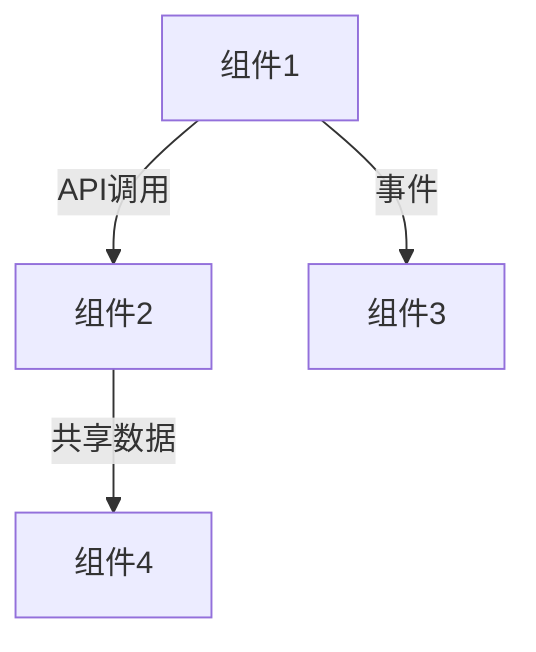

# 全局组件架构

**创建日期**：[DATE]  
**最后更新**：[DATE]  
**版本**：1.0.0

## 概述

本文档维护整个产品的组件/限界上下文架构，采用领域驱动设计（DDD）方法。每个组件代表一个限界上下文，包含其职责、边界、技术栈和数据所有权。

## 组件索引

| 组件ID | 组件名称 | 类型 | 职责概述 | 状态 |
|--------|---------|------|---------|------|
| C-001 | [组件名称] | [微服务/模块/服务] | [简要职责] | [活跃/已弃用] |

---

## 组件详情

### C-001 - [组件名称]

**组件类型**：[微服务/模块/服务]  
**限界上下文**：[业务领域/子域]  
**状态**：[活跃/已弃用]  
**创建日期**：[DATE]  
**最后更新**：[DATE]

#### 职责与边界

**核心职责**：
- [职责1]
- [职责2]
- [职责3]

**业务边界**：
- **包含**：[此组件负责的业务领域]
- **不包含**：[明确不属于此组件的职责]

**技术边界**：
- **技术栈**：[主要技术选择]
- **运行时环境**：[部署环境要求]
- **数据存储**：[数据存储方式]

#### 数据所有权

**拥有的实体**：
- [Entity1] - 来源：[###-spec-name]
- [Entity2] - 来源：[###-spec-name]

**数据访问模式**：
- **直接访问**：拥有完全控制权的实体
- **共享访问**：与其他组件共享的实体
- **只读访问**：仅读取其他组件拥有的实体

#### API 接口

**提供的 API**：
- 基础路径：`/api/v1/[component]`
- API 版本：v1.0
- 端点数量：[数量]

**主要端点**：
- `GET /api/v1/[resource]` - [端点描述]
- `POST /api/v1/[resource]` - [端点描述]

**API 文档**：参考 `/memory/api-global.md` 中此组件的详细端点定义

#### 依赖关系

**依赖的组件**：
- [C-002] - [依赖原因] - 通过 [同步API/异步事件/共享数据] 通信
- [C-003] - [依赖原因] - 通过 [同步API/异步事件/共享数据] 通信

**被依赖的组件**：
- [C-004] - 依赖此组件的 [功能/数据]
- [C-005] - 依赖此组件的 [功能/数据]

**集成模式**：
- **同步调用**：[列出同步API调用]
- **异步事件**：[列出发布/订阅的事件]
- **共享数据**：[列出共享的数据实体]

#### 关联的功能规范

| Spec ID | 功能名称 | 关联类型 | 状态 |
|---------|---------|---------|------|
| [###-spec-name] | [功能名称] | [主要/次要] | [规划中/开发中/已完成] |

---

### C-002 - [组件名称]

[类似的组件结构]

---

## 组件间关系图

<!--
  可以用 Mermaid 或其他图表工具描述组件间的关系
-->

## 架构原则

### 组件设计原则

- **单一职责**：每个组件应有明确的单一职责
- **高内聚低耦合**：组件内部高内聚，组件间低耦合
- **数据所有权**：每个实体应有明确的拥有者组件
- **API 优先**：组件间通过明确的 API 接口通信
- **事件驱动**：适合的场景使用异步事件通信

### 组件拆分原则

- **业务边界**：按业务领域或子域划分
- **技术边界**：考虑技术栈差异和部署需求
- **规模控制**：避免组件过大或过小
- **依赖最小化**：尽量减少组件间的依赖

## 版本历史

| 版本 | 日期 | 主要变更 | 影响的组件 |
|------|------|---------|-----------|
| 1.0.0 | [DATE] | 初始版本 | [C-001] |

